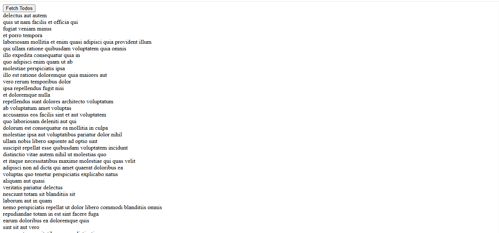

#  React To-Do Application

##  Overview

React To-Do Application is a simple web app that fetches and displays to-do tasks from a public API. It demonstrates API integration, state management using Redux Toolkit, and dynamic rendering of data in the UI.

---

##  Features

*  Fetch to-do tasks from a public API
*  Display tasks dynamically in UI
*  State management using Redux Toolkit
*  Async data fetching using `createAsyncThunk`
*  Simple and clean user interface

---

##  Tech Stack

### Frontend

* React.js
* Redux Toolkit (`createAsyncThunk`)
* JavaScript 

### API

* Public REST API (for fetching to-do data)

---

##  Screenshots

###  To-Do App UI



---

## Live Demo

https://react-todo-app-livid-gamma.vercel.app/

---

## Run Locally

```bash id="c9axf3"
# Clone the repository
git clone https://github.com/dhwani1006/React-ToDo-App.git

# Install dependencies
npm install

# Run the app
npm run dev
```

---

## 💡 How It Works

1. User clicks "Fetch Todos"
2. App sends request to public API using `createAsyncThunk`
3. Data is stored in Redux state
4. UI updates and displays the task list

---

